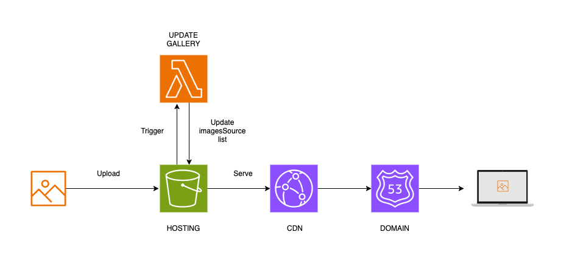
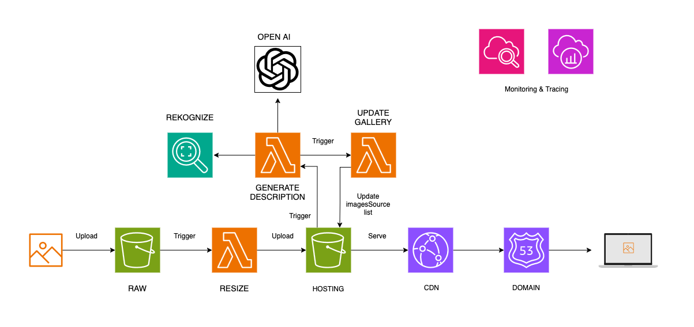
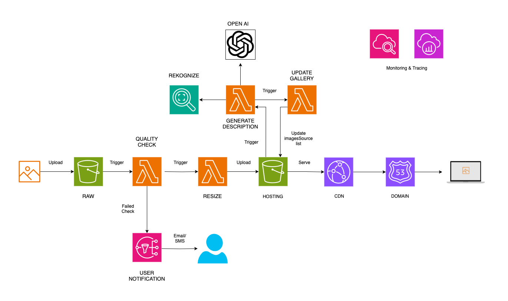

# Photoproject

**This is Work in Progress! Currently working on POC stage. Text below describes the vision for the whole project to give basic overview.**

## Vision

Photoproject is a personal project showcasing my experience with **cloud** and **DevOps** practices. It also combines my two passions—**photography** and **programming**. The final product serves as a **private photo gallery**, hosted in the user's own AWS account.

The project is designed so that anyone can **clone the repository** and follow the provided instructions to set it up. Everything is **automated as much as possible**:

- **Infrastructure** is provisioned using **Terraform**.
- **Deployments and uploads** are managed through **GitHub Actions**.
- **Bash scripts** automate necessary setup steps.
- **Cost management and alerts** are set up to minimize unnecessary expenses.

The final product is an **AWS-hosted photo gallery** where users can add new images by uploading them to a **dedicated S3 bucket**. The project consists of **three stages**, each building upon the previous one and introducing new features.

---

### Stages

#### POC

This stage provides only the basic functionality—**displaying the photo gallery online**:

- The photo gallery website is **served statically** from an **S3 bucket**.
- Whenever a new image is uploaded to a **specific folder** in the S3 bucket, a **Lambda function** is triggered to update the image list.
- **HTTPS** is enabled using **CloudFront**, and the website is accessible via a **custom domain name** managed through **Route 53**.

#### MVP1

This stage introduces **new features** to enhance the photo gallery:

- Images are **uploaded to a raw S3 bucket** instead of the hosting bucket, allowing **validation checks** (in this stage, just a size check) before they are displayed.
- If an uploaded image **exceeds 1MB**, a **Lambda function** is triggered to **downsize** it before transferring it to the hosting bucket. Smaller images are moved directly without modification.
- **Alternative text and descriptions** are automatically generated using **AWS Rekognition** for object detection and the **OpenAI API** to create descriptive text from detected labels. These descriptions are then added to the image list.
- The application is **monitored** using **CloudWatch logs** and **AWS X-Ray** for tracing.

#### MVP2

This stage represents the **final version** of the photo gallery, introducing an **image quality check**:

- After an image is **uploaded to the raw S3 bucket**, a **quality check** is triggered to filter out images that are **too blurry, too dark, or too bright**.
- If an image **fails the quality check**, the user is **notified via email or SMS**, depending on their preferred notification method.

This stage of the project demonstrates a **fully automated, serverless photo gallery** with **quality control, AI-powered descriptions, and cost optimization**. 🚀

